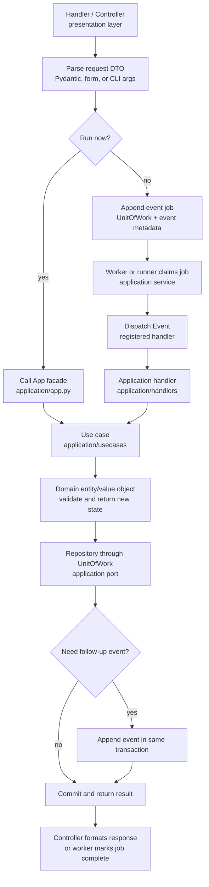
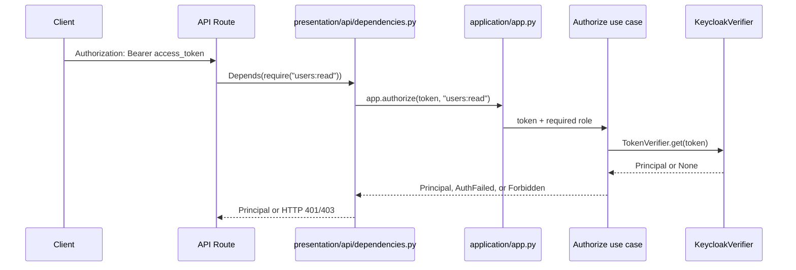

# Architecture

This document is the template-specific architecture source of truth. It explains
the reusable structure that should remain when this repository is specialized
for a concrete product.

Keep this guide in `docs/architecture.md` because it owns repository structure,
layer boundaries, ports, events, app wiring, and extension patterns. Keep brief
setup instructions in `README.md`; keep reusable coding standards in
`docs/rules.md`; keep task procedure in `docs/workflows.md`; keep test strategy
in `docs/tests.md`.

## Architecture Shape

The template uses a small clean-architecture split with a flat `src/` layout:

```text
src/
  domain/          # entities, value objects, domain errors, event contracts
  application/     # use cases, services, event handlers, ports, app facade
  infrastructure/  # concrete adapters, persistence, config, logging
  presentation/    # HTTP, worker, CLI, or other process entrypoints
  main.py          # optional local process launcher
tests/             # pytest behavior tests
docs/              # architecture, rules, workflows, and test guidance
```

Dependency direction:

```text
presentation -> application -> domain
infrastructure -> application ports + domain
application.app -> infrastructure (composition root only)
```

Rules:

- Domain modules import nothing from application, infrastructure, or
  presentation.
- Application use cases and handlers depend on ports from
  `application/adapters/core.py`, not concrete adapters.
- Infrastructure adapters implement application ports and translate
  infrastructure shapes into domain/application shapes.
- Presentation entrypoints parse transport input and format transport output.
  They do not make business decisions.
- `application/app.py` is the composition root. It wires concrete adapters,
  use cases, services, event handlers, and process-facing facade methods.

## Component Responsibilities

| Component | Owns | Does not own | Locations |
| --- | --- | --- | --- |
| Handler / controller | Entry points, request parsing, response formatting, expected error translation | Business rules, persistence details, concrete client construction | `src/presentation/*/routes/`, `src/application/handlers/` |
| Service / use case | Business workflow coordination, port calls, transaction boundaries, local truth checks | HTTP details, ORM rows, provider SDK details | `src/application/usecases/`, `src/application/services/` |
| Domain entity / value object | Invariants, identity, immutable state transitions, validation | Repositories, config, logging, framework concerns | `src/domain/entity.py`, `src/domain/value.py`, `src/domain/error.py` |
| Event | Decoupled work contract, topic/kind/version routing, durable payload shape | Executing behavior, formatting responses, queue storage mechanics | `src/domain/event.py`, `src/application/handlers/`, `src/application/services/` |
| Port / adapter | Swappable dependency contracts and concrete infrastructure translation | Domain decisions, transport response formatting | `src/application/adapters/core.py`, `src/infrastructure/` |
| App facade | Composition and public application surface for entrypoints | Domain invariants, request parsing | `src/application/app.py` |

## Request And Event Flow

Synchronous work can call a use case directly through the app facade. Work that
should be decoupled, retried, or processed later should be represented as an
event and dispatched by a service such as an outbox runner or queue worker.



Lifecycle rules:

- Controllers validate untrusted input at the edge.
- Use cases load current state, call domain behavior, persist returned state,
  and explicitly commit.
- Domain objects enforce invariants and return new immutable state.
- Events carry small versioned payloads. Handlers convert payload values back
  into domain/application inputs.
- Follow-up events that must not be lost are written in the same unit of work as
  the state change that caused them.

## Authentication And Authorization

Authentication and authorization are owned by the application boundary and
implemented through infrastructure adapters. Domain modules must not know about
Keycloak, JWTs, HTTP headers, browser sessions, or identity-provider groups.

The application contract is:

- `Principal` in `src/application/dto.py` represents the trusted caller shape
  accepted by application code.
- `TokenVerifier` in `src/application/adapters/core.py` is the provider-neutral
  port for validating bearer tokens.
- `Authorize` in `src/application/usecases/auth.py` authenticates one token and
  requires one `resource:action` role before returning a `Principal`.
- `AuthFailed` and `Forbidden` in `src/application/error.py` describe expected
  authentication and authorization failures.

The infrastructure implementation is:

- `KeycloakVerifier` in `src/infrastructure/auth/keycloak.py` implements the
  `TokenVerifier` port.
- It verifies Keycloak access tokens against the realm issuer and JWKS, caches
  signing keys, refreshes keys when a token references an unknown `kid`, and
  extracts client roles from `resource_access.<client_id>.roles`.
- Keycloak-specific failures are translated to `AuthError` in
  `src/infrastructure/error.py` and do not leak into presentation routes.
- Keycloak settings, OIDC endpoints, client id, client secret, and session
  settings live in `src/infrastructure/config.py`.

`application/app.py` is the composition root. It wires
`Authorize(KeycloakVerifier(settings.keycloak))` and exposes the workflow as
`app.authorize(token, role)`.

API bearer-token flow:



Routes should use the presentation helper:

```python
principal: Principal = Depends(require("users:read"))
```

The helper may parse HTTP bearer credentials and translate `AuthFailed` to
`401` and `Forbidden` to `403`, but it should not construct provider clients or
make authorization decisions itself.

HTMX browser login flow:

- `GET /login` redirects the browser to Keycloak's authorization endpoint with
  a signed state cookie.
- `GET /callback` validates the state cookie, exchanges the authorization code
  at Keycloak's token endpoint, reads the userinfo endpoint, and stores a small
  signed local session cookie.
- `GET /logout` clears the local session and redirects to Keycloak's logout
  endpoint.
- Browser session cookies are presentation concerns in
  `src/presentation/htmx/security.py`; they do not replace API bearer-token
  authorization for protected API routes.

Keycloak realm configuration lives in
`infrastructure/config/keycloak/realm-export.json`. The template client uses
client roles named with the `resource:action` convention, such as
`users:read` and `users:create`. Groups such as `Admin` and `User` collect those
permissions, while application code checks the specific permission required by
the route or workflow.

## Handler / Controller Blueprint

Use controllers for transport-facing entrypoints. Keep them thin and explicit.

```python
from __future__ import annotations

from fastapi import APIRouter, Depends, HTTPException
from pydantic import BaseModel, Field

from application.app import App, get_app
from application.error import ApplicationError
from domain.entity import Thing
from domain.error import DomainError

routes = APIRouter(prefix="/things", tags=["things"])


class CreateThingRequest(BaseModel):
    name: str = Field(min_length=1)


class ThingResponse(BaseModel):
    id: str
    name: str

    @classmethod
    def from_domain(cls, thing: Thing) -> ThingResponse:
        return cls(id=thing.id, name=thing.name.value)


@routes.post("", status_code=201)
def create_thing(
    request: CreateThingRequest,
    app: App = Depends(get_app),
) -> ThingResponse:
    try:
        thing = app.create_thing(request.name)
    except (ApplicationError, DomainError) as exc:
        raise http_error(exc) from exc
    return ThingResponse.from_domain(thing)


def http_error(exc: Exception) -> HTTPException:
    status = 422 if isinstance(exc, DomainError) else 409
    code = getattr(exc, "code", "api.error")
    return HTTPException(status, {"code": code, "message": str(exc)})
```

Implementation steps:

1. Add the request DTO near the route that owns the transport contract.
2. Convert request DTOs into domain values before calling the app facade when
   the values carry domain meaning.
3. Catch expected domain/application errors and translate them to transport
   errors.
4. Register the router in the presentation app factory.
5. Add route tests around request parsing, expected errors, and response shape.

Event handlers are application entrypoints for events, not transport
controllers:

```python
from __future__ import annotations

import asyncio

from application.usecases.things import CreateThingUseCase
from domain.event import ThingCreated


class ThingCreatedHandler:
    """Handle one event by calling one use case."""

    def __init__(self, create_thing: CreateThingUseCase) -> None:
        self.create_thing = create_thing

    async def __call__(self, event: ThingCreated) -> None:
        await asyncio.to_thread(
            self.create_thing,
            event.payload["name"],
        )
```

## Service / Use Case Blueprint

Use cases coordinate behavior. They should read as a small sequence:

1. Parse or construct domain input.
2. Load current state through ports.
3. Call domain behavior.
4. Persist returned state.
5. Commit.
6. Return a domain object or application DTO.

Define use-case failures in `src/application/error.py`:

```python
class ThingNotFound(ApplicationError):
    code = "thing.not_found"
```

Implement use cases in `src/application/usecases/<area>.py`:

```python
from __future__ import annotations

from collections.abc import Callable

from application.adapters.core import UnitOfWork
from application.error import ThingNotFound
from domain.entity import Thing, ThingName


class CreateThingUseCase:
    """Create one Thing and persist it atomically."""

    def __init__(self, uow_factory: Callable[[], UnitOfWork]) -> None:
        self.uow_factory = uow_factory

    def __call__(self, raw_name: str) -> Thing:
        thing = Thing.create(ThingName(value=raw_name))

        with self.uow_factory() as uow:
            uow.things.add(thing)
            uow.commit()

        return thing


class RenameThingUseCase:
    """Load current state, apply a domain transition, and save it."""

    def __init__(self, uow_factory: Callable[[], UnitOfWork]) -> None:
        self.uow_factory = uow_factory

    def __call__(self, thing_id: str, raw_name: str) -> Thing:
        with self.uow_factory() as uow:
            thing = uow.things.get(thing_id)
            if thing is None:
                raise ThingNotFound(f"thing {thing_id} was not found")

            renamed = thing.rename(ThingName(value=raw_name))
            uow.things.add(renamed)
            uow.commit()
            return renamed
```

Use case rules:

- Depend on protocols, not infrastructure classes.
- Keep transaction boundaries explicit.
- Put workflow decisions here, not in repositories or controllers.
- Validate adapter output before it drives writes or state transitions.
- Return the domain object or a dedicated DTO; do not return ORM rows.

## Domain Entity And Value Object Blueprint

Domain models are immutable by default. Value objects validate concepts without
identity. Entities and aggregates own identity and state transitions.

Define specific domain failures in `src/domain/error.py`:

```python
class InvalidThingName(DomainError):
    code = "thing_name.invalid"


class ThingArchived(DomainError):
    code = "thing.archived"
```

Define domain models in `src/domain/entity.py`:

```python
from __future__ import annotations

from uuid import uuid4

from pydantic import Field, model_validator

from domain.error import InvalidThingName, ThingArchived


class ThingName(DomainModel):
    """Validated value object."""

    value: str = Field(min_length=1)

    @model_validator(mode="after")
    def validate_name(self) -> ThingName:
        if self.value.strip() != self.value:
            raise InvalidThingName("thing name must not have surrounding whitespace")
        return self


class Thing(DomainModel):
    """Aggregate root for one business concept."""

    id: str = Field(default_factory=lambda: str(uuid4()))
    name: ThingName
    archived: bool = False

    @classmethod
    def create(cls, name: ThingName) -> Thing:
        return cls(name=name)

    def rename(self, name: ThingName) -> Thing:
        if self.archived:
            raise ThingArchived("archived things cannot be renamed")
        return self.model_copy(update={"name": name})

    def archive(self) -> Thing:
        return self.model_copy(update={"archived": True})
```

Domain rules:

- Domain modules must not import application, infrastructure, or presentation.
- Keep identity rules close to the entity.
- Raise specific typed errors with stable `code` values.
- Use constructors or `model_copy(update={...})` for transitions.
- Keep persistence conversion in infrastructure rows or repositories.

## Ports And Adapters Blueprint

Use a port when a use case needs a dependency that may have multiple
implementations or a test fake.

Define ports in `src/application/adapters/core.py`. Extend the existing
`UnitOfWork` protocol rather than creating a second one:

```python
from typing import Protocol, runtime_checkable

from domain.entity import Thing


@runtime_checkable
class ThingRepo(Protocol):
    def add(self, entity: Thing, /) -> Thing: ...
    def get(self, entity_id: str, /) -> Thing | None: ...
    def list(self) -> list[Thing]: ...


@runtime_checkable
class UnitOfWork(Protocol):
    things: ThingRepo

    def __enter__(self) -> UnitOfWork: ...
    def __exit__(self, exc_type, exc, tb) -> None: ...
    def commit(self) -> None: ...
    def rollback(self) -> None: ...
```

Implement adapters in `src/infrastructure/`:

```python
class ThingRepoSql:
    """SQL-backed Thing repository."""

    def __init__(self, session) -> None:
        self.session = session

    def add(self, entity: Thing) -> Thing:
        self.session.merge(ThingRow.from_domain(entity))
        return entity

    def get(self, entity_id: str) -> Thing | None:
        row = self.session.get(ThingRow, entity_id)
        return row.to_domain() if row else None
```

Adapter rules:

- Translate infrastructure data into domain objects at the boundary.
- Keep provider SDKs, ORM sessions, and filesystem details out of use cases.
- Do not hide workflow decisions inside repositories.
- Make external dependencies explicit in constructors.

## Event Blueprint

Events are versioned contracts for decoupled internal work. Define event topics
and kinds in `src/domain/value.py`, event classes in `src/domain/event.py`, and
handlers in `src/application/handlers/`.

```python
# Add members to existing enums in src/domain/value.py.
class EventTopic(StrEnum):
    THING = "thing"


class EventKind(StrEnum):
    CREATED = "created"
```

```python
# Add event classes below the Event/register definitions in src/domain/event.py.
@register
class ThingCreated(Event[dict[str, str]]):
    topic = EventTopic.THING
    kind = EventKind.CREATED
    version = 1
```

Append durable event work through a unit of work:

```python
with app.uow_factory() as uow:
    job = uow.outbox.append(
        ThingCreated.topic,
        ThingCreated.kind,
        {"name": request.name},
        ThingCreated.version,
        idempotency_key=f"thing:create:{request.name}",
    )
    uow.commit()
return {"job_id": job.id}
```

Wire the event in `src/application/app.py`:

```python
self.create_thing = CreateThingUseCase(self.uow_factory)

self.dispatcher.register(
    ThingCreated,
    ThingCreatedHandler(self.create_thing),
)

self.runner = OutboxRunner(
    dispatcher=self.dispatcher,
    events=(ThingCreated,),
    limit=self.settings.worker_batch_limit,
    factory=self.uow_factory,
)
```

Event rules:

- Payloads should be small JSON-serializable values.
- Handlers should convert payloads into domain/application inputs.
- Every event that should be processed by a worker must be registered with the
  dispatcher and included in the runner's event list.
- Use idempotency keys when duplicate enqueue requests should collapse to one
  durable job.
- Keep behavior out of event classes.

## App Wiring Blueprint

`application/app.py` is the only application module that imports concrete
infrastructure for composition.

```python
class App:
    """Application facade used by entrypoints."""

    def __init__(self, settings: Settings) -> None:
        self.settings = settings
        self.database = SqlDatabase(settings.database)
        self.database.create_all()

        self.uow_factory = lambda: SqlUnitOfWork(
            self.database.sessions(),
            self.settings.outbox,
        )

        self.create_thing = CreateThingUseCase(self.uow_factory)
        self.rename_thing = RenameThingUseCase(self.uow_factory)

        self.dispatcher = EventDispatcher()
        self.dispatcher.register(
            ThingCreated,
            ThingCreatedHandler(self.create_thing),
        )

        self.runner = OutboxRunner(
            dispatcher=self.dispatcher,
            events=(ThingCreated,),
            limit=self.settings.worker_batch_limit,
            factory=self.uow_factory,
        )
```

App wiring rules:

- Build adapters once at the composition boundary.
- Expose use cases as facade attributes when entrypoints need them.
- Do not put business decisions in `App`.
- Register handlers and runner events together so event dispatch stays visible.

## Extension Checklist

For a new capability, follow this order:

1. Define domain value objects, entities, and typed domain errors.
2. Add application errors for use-case failures such as missing records.
3. Add or extend ports when a use case needs persistence, external clients,
   queues, or test doubles.
4. Implement the use case with explicit `UnitOfWork` boundaries.
5. Add infrastructure rows, repositories, adapters, or config only for ports the
   use case needs.
6. Add events and handlers when work should be decoupled, retryable, or durable.
7. Wire use cases, adapters, handlers, and runner events in `application/app.py`.
8. Add presentation controllers that parse input and format output.
9. Add focused tests at the touched boundaries, following `docs/tests.md`.
10. Update this document when the change creates a new template pattern, public
    contract, event, model, port, or workflow.
